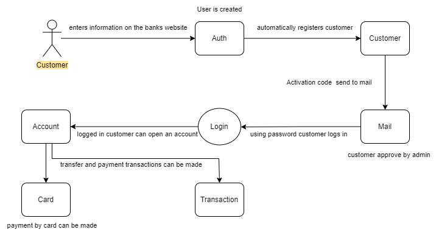
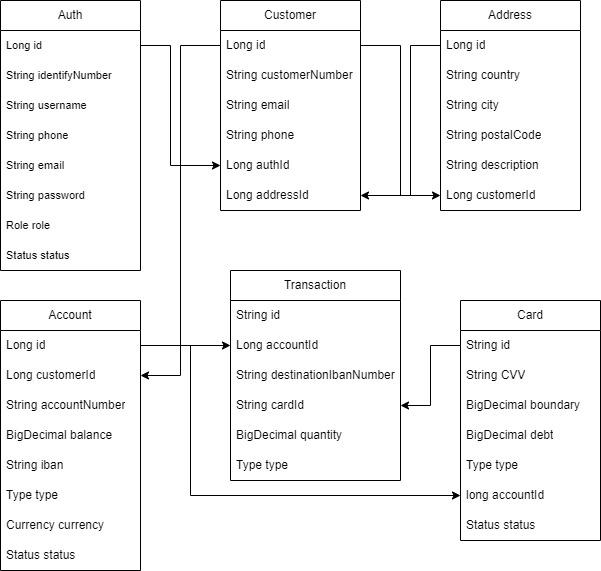

# Bank of Mars
## Used Technologies & Arhitecture:
- Microservice Architecture  
- Java 17
- Spring Boot
  * Mail Sender
  * Spring Security
- Spring Cloud
  * Open Feign
  * Config Server
  * Zipkin
  * Gateway
- PostgreSQL
- MongoDB
- RabbitMQ
- JWT
- Swagger
- Docker
- Google Cloud
- Kubernates Engine
- Kubernates Clusters
## About Project
The basic operating principle of the project is as follows. Customers can create accounts and cards within certain rules after the following procedures. They can link multiple accounts to a single card. They can deposit and withdraw money from their accounts. They can transfer money to another account. They can make payments with the card they created. They can pay off their card debts with the balance in their accounts.  
  
## Functions
- User Management
- Customer Management
- Account Management
- Card Management
- Transaction Management
### Customer Management
Creating, updating and deleting customers will be possible through the APIs to be created.
### Account Management
Bank customers will be allowed to create and delete accounts through APIs so that they can use them to control their investments. Accounts can be opened in TL, Euro or Dollar currencies. Two accounts in the same currency will be able to make money transfers and card payments. They will also be able to make deposits and withdrawals to their accounts
### Card Management
Repaid debit cards and credit cards are offered to customers by the bank to be used at ATMs or for shopping. The functions of creating these cards, associating them with the customer and account, and transferring money (shopping) using the card will be provided through APIs.
### Transaction Management
Appropriate APIs should be provided to manage customers' money transfers. Customers can make payments and transfers. Transfers can only be made via IBAN.
## Database Diagrams

